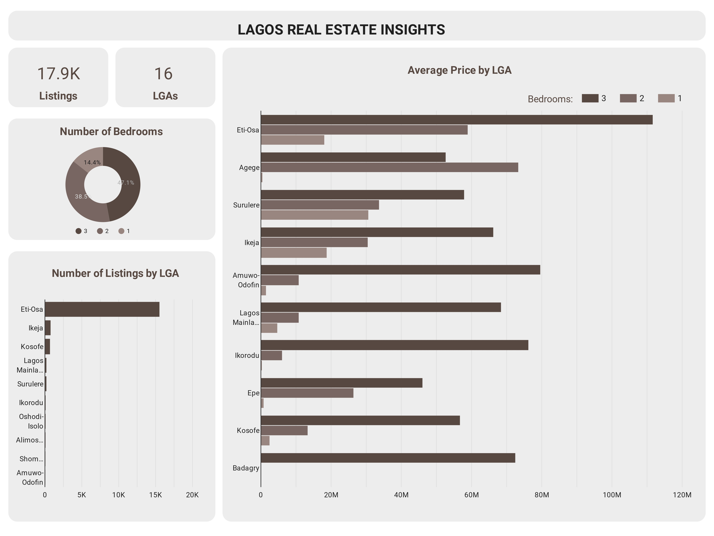
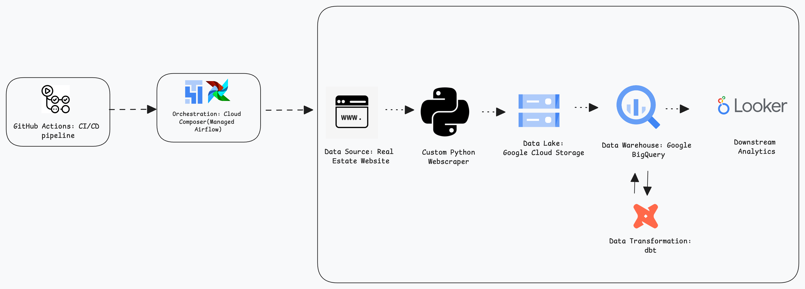

# Lagos Real Estate ELT pipeline

## Overview
This project develops a robust end-to-end ELT (Extract, Load, Transform) pipeline using Lagos house listings data. The solution leverages Google Cloud Platform services, including Cloud Composer (managed Airflow), Google Cloud Storage, and BigQuery, along with dbt for transformations. A CI/CD pipeline ensures smooth deployment and updates. The primary objective is to derive actionable insights into property prices, features, and locations across Lagos.

## Insights


## Data Architecture

Figure 1: Data Architecture

This project utilizes a fully cloud based architecture, leveraging the following services:
- Cloud Composer: Orchestrates the entire data pipeline, managing web scraping, data transfer, and transformation tasks.
- Google Cloud Storage (GCS): Acts as a data lake, storing scraped data before processing.
- BigQuery: Serves as the data warehouse for transformed data, ready for analysis.
- dbt core: Handles data transformations within BigQuery.
- CI/CD Pipeline: Automates testing, building, and deployment processes, ensuring code quality and smooth updates.

## Deployment and Execution

The project is deployed and runs entirely in the cloud:

- Changes are pushed to the GitHub repository.
- The CI/CD pipleline triggers, running tests and deploying updates.
- CLoud composer executes the DAGs onschedule, orchestrating the entire data pipeline.
- Data flows from webscraping to GCS, then to BigQuery for transformation and analysis.

## How to Replicate

To replicate this project, follow these steps:
- Set up the Google CLoud Platform(GCP)
    - Create a GCP account, if you don't have one.
    - Set up a new project in GCP.
    - Enable necessary APIs: Cloud Composer, Cloud Storage, and BigQuery.

- Clone the repository
    ```bash
    git clone <repository_url>
    cd lag-house
    ```
- Set up Cloud Composer
    - In GCP Console, navigate to Cloud Composer.
    - Create a new environment, selecting the appropriate configuration.
        - Choose an appropriate name for the environment.
        - Select the region where you want to deploy the environment.
        - Select the desired image version for the environment(I used composer-3-airflow-2.9.1-build.6).
        - Select the desired service account for the environment(If you don't have one, create a new one).
        - Choose environment resources.
        - Set up network configurations if required and if you are conversant with networking(I  selected the default).
        - Set up a custom bucker for the environment(I used the default).
        - Add envoiroment variables, or you can add them via the airflow web interface when the environment is created.
        - Add the following enviroment variables:
            - base_url: The URL for scraping house listings
            - city: Set to "Lagos" or any city of your choice.
            - project_id: Your GCP project ID
            - dataset_id: The BigQuery dataset ID for your project
            - bucket_name: The GCS bucket name for storing scraped data
            - lag_house_schema: The schema for your BigQuery tables
            - start_page: The page number to start scraping from.
            - end_page: The page number to end scraping at.
            - chunk_size: The number of pages to scrape per pass.

- Set up BigQuery
    - Create a new dataset in BigQuery.
- Set up GitHub Actions for CI/CD
    - In your GitHub repository, go to Settings > Secrets
    - Add the following secrets:
        - `GCP_PROJECT_ID`: Your GCP project ID.
        - `GCP_SA_KEY`: The JSON key of a service account with necessary permissions.

- Configure CI/CD Pipeline
    - The `.github/workflows/ci_cd.yml` file defines the CI/CD process.
    - It inlcudes steps for testing, building, and deploying to Cloud Composer
    - Ensure the workflow file is properly configured with your project details.

- Deploy DAGs and dbt Models
    - Push your changes to the GitHub repository.
    - The CI/CD pipeline will automatically:
        - Run tests.
        - Build any necessary components.
        - Deploy the DAGs to your Cloud Composer environment.
        - Deploy the dbt models to the appropriate location.

- Verify Deployment
    - Access your Cloud Composer environment's Airflow UI.
    - Check that the DAGs are present and properly confugured.
    - Manually trigger a DAG run to test the pipeline.

- Monitor and Maintain
    - Regularly check the Airflow UI for DAG runs and their status.
    - Monitor BigQuery for successful daya loads and ztransformations.      
    - Review GCS buckets to ensure data is being stored correctly.                                                                                                                                                                                     